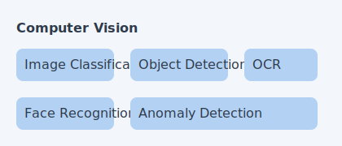
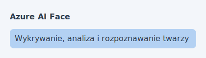

[⟵ Poprzedni: Podstawy uczenia maszynowego](03-machine-learning.md) | [Następny: Natural Language Processing ⟶](05-nlp.md)

# 4. **Computer Vision** na **Azure**

## Czym jest **Computer Vision**?
- **Computer Vision** to dziedzina AI zajmująca się analizą i interpretacją obrazów oraz wideo przez komputer. Pozwala na automatyczne rozpoznawanie, klasyfikowanie i interpretowanie zawartości wizualnej, co znajduje zastosowanie w wielu branżach.

## Typowe zadania

> **Na egzaminie AI-900**: Rozróżniaj Image Classification (co jest na obrazie?) vs Object Detection (gdzie jest obiekt? + bounding box) vs Segmentation (dokładne piksele obiektu). Każde zadanie daje inny wynik.

- **Przykładowy przepływ Computer Vision:**

- **Klasyfikacja obrazów (Image Classification)** – przypisywanie etykiet do całych obrazów (np. rozpoznawanie gatunku zwierzęcia na zdjęciu).
- **Detekcja obiektów (Object Detection)** – lokalizowanie i klasyfikowanie wielu obiektów na jednym obrazie (np. wykrywanie samochodów na drodze).
- **OCR (Optical Character Recognition)** – rozpoznawanie tekstu na obrazach, digitalizacja dokumentów papierowych (np. faktury, paragony, umowy).
- **Rozpoznawanie twarzy (Face Recognition)** – identyfikacja osób, analiza emocji, weryfikacja tożsamości.
- **Detekcja anomalii (Anomaly Detection)** – wykrywanie nietypowych wzorców lub defektów na obrazach (np. kontrola jakości w produkcji, wykrywanie uszkodzeń na liniach montażowych).

## Usługi **Azure**

- **Azure AI Vision** – kompleksowa usługa do analizy obrazów i wideo. Umożliwia:
	- Klasyfikację obrazów (Image Classification)
	- Detekcję obiektów (Object Detection)
	- OCR (rozpoznawanie tekstu na obrazach)
	- Analizę cech wizualnych (np. kolory, kształty, tagi)
	- Moderację treści (wykrywanie treści nieodpowiednich)
	- **Segmentację obrazów (Image Segmentation)** – wyodrębnianie obszarów pikseli przynależących do różnych obiektów na obrazie
	- **Analizę przestrzenną (Spatial Analysis)** – śledzenie ruchu osób, liczenie w strefach, mierzenie dystansów w czasie rzeczywistym z kamer
	- Wykrywanie marek (Brand Detection) i znanych osób (Celebrity Detection)
	- Rozpoznawanie punktów orientacyjnych (**Domain: Landmarks**) – identyfikacja znanych budynków/miejsc

> **Na egzaminie – funkcje Azure AI Vision**:
> - Chcesz **znaleźć lokalizację obiektów** na obrazie → pobierz **Objects** (zwraca bounding box + etykiety)
> - Chcesz **rozpoznać znane budynki/miejsca** → pobierz **Categories** z domeną **Landmarks** (nie Celebrities)
> - Chcesz **opisać co jest na obrazie** → pobierz **Tags** lub **Description**
> - **Semantic segmentation** = klasyfikacja każdego piksela obrazu (np. droga, budynek, niebo)
> - Azure Vision in Foundry Tools: obsługuje **OCR**, **generowanie tagów/opisów**, **spatial analysis** (NIE sentyment, NIE entity recognition – to NLP)

- **Azure AI Custom Vision** – trenowanie własnych modeli klasyfikacji i detekcji obiektów bez pisania kodu:

  - Wgrywanie i etykietowanie własnych zdjęć (data labeling)
  - Trenowanie modelu jednym kliknięciem
  - Eksport gotowego modelu do Edge/ONNX/CoreML/TensorFlow
  - Dwa tryby: **Image Classification** (co jest na zdjęciu?) i **Object Detection** (gdzie jest obiekt?)

> **Na egzaminie**: Typy zasobów Custom Vision:
> - **Custom Vision resource** – można utworzyć osobno do treningu (Training) lub predikcji (Prediction)
> - **Cognitive Services (Azure AI Services) resource** – jeden zasób dla treningu I predikcji z tym samym kluczem i endpointem
> - Aby poprawić model: **dodaj więcej zdjęć** (nie zmniejszaj rozmiaru, nie dodawaj klasy „unknown")
> - Po opublikowaniu modelu: deweloper potrzebuje **Project ID + nazwa modelu + klucz i endpoint zasobu predikcji**

- **Azure AI Document Intelligence** (dawniej Form Recognizer) – automatyczna ekstrakcja danych ze strukturyzowanych dokumentów:

  - Odczytywanie par klucz-wartość, tabel i pól formularzy
  - Gotowe modele: **Invoice** (faktury), **Receipt** (paragony), **ID Document** (dowody), **Business Card**
  - Możliwość trenowania własnych modeli na niestandardowych typach dokumentów
  - **Read API** – do odczytu tekstu z dużych dokumentów PDF (wielostronicowych). **OCR API** jest do prostych, jednostronicowych obrazów. Na egzaminie: dla dużych PDF-ów wybieraj **Read API**.
  - Maksymalny rozmiar pliku: **50 MB** dla gotowych modeli (Invoice, Receipt)

> **Na egzaminie**: Do utworzenia zasobu Document Intelligence (Form Recognizer) można użyć: **Form Recognizer resource** LUB **Cognitive Services (Azure AI Services) resource** – obie odpowiedzi są poprawne.

- **Azure AI Face** – specjalistyczna usługa do rozpoznawania i analizy twarzy. Pozwala na:

  - Detekcję i identyfikację twarzy na zdjęciach i wideo
  - Analizę emocji, wieku, płci, zarostu, okularów, pozycji głowy
  - Weryfikację tożsamości (np. logowanie biometryczne)
  - Grupowanie i porównywanie twarzy
  - **Face Liveness Detection** – wykrywanie żywej osoby (ochrona przed atakami z użyciem zdjęć lub wideo)
  - **Ograniczony dostęp (Limited Access)** – identyfikacja i weryfikacja twarzy wymagają formalnej akceptacji przez Microsoft

> **Na egzaminie – 3 poziomy Face**:
> - **Face Detection (detekcja)** – znajdowanie twarzy na obrazie. Zwraca **bounding box** (prostokątne współrzędne) dla każdej twarzy. Czynniki utrudniające detekcję: **ekstremalny kąt** nachylenia głowy.
> - **Face Analysis (analiza)** – atrybuty twarzy: wiek, płeć, emocje, okulary, zarost, pozycja głowy.
> - **Face Identification (identyfikacja)** – rozpoznawanie „kto to jest". Wymaga: **utworzenia grupy (PersonGroup) z wieloma zdjęciami każdej osoby i wytrenowania modelu**.
> - **Face Verification** – porównanie 1:1 (czy to ta sama osoba). **Find Similar Faces** – porównanie 1:wiele.

## Przykłady zastosowań
- **Automatyczna moderacja zdjęć** w mediach społecznościowych (usuwanie treści nieodpowiednich)
- **Weryfikacja tożsamości** w bankowości i systemach bezpieczeństwa (biometria twarzy)
- **Digitalizacja dokumentów** – automatyczne odczytywanie danych z faktur, paragonów, umów (OCR)
- **Wykrywanie defektów** na liniach produkcyjnych (detekcja anomalii, kontrola jakości)
- **Systemy monitoringu** – wykrywanie podejrzanych zachowań lub obiektów
- **Aplikacje dla osób niewidomych** – opisywanie otoczenia na podstawie obrazu z kamery

[⟵ Poprzedni: Podstawy uczenia maszynowego](03-machine-learning.md) | [Następny: Natural Language Processing ⟶](05-nlp.md)
