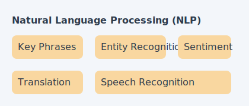

[⟵ Poprzedni: Computer Vision](04-computer-vision.md) | [Następny: Generatywna AI ⟶](06-generative-ai.md)

# 5. **Natural Language Processing (NLP)**

## Czym jest **NLP**?
- **Natural Language Processing (NLP)** to dziedzina AI zajmująca się przetwarzaniem, analizą i rozumieniem języka naturalnego przez komputery. Obejmuje zarówno tekst pisany, jak i mowę. NLP pozwala maszynom rozumieć, generować, tłumaczyć i analizować język ludzki.

## Typowe zadania

- **Ekstrakcja fraz kluczowych (Key Phrase Extraction)** – wyodrębnianie najważniejszych słów i zwrotów z tekstu.
- **Rozpoznawanie encji (Entity Recognition)** – identyfikacja nazw własnych, takich jak osoby, miejsca, organizacje.
- **Entity Linking (łączenie encji)** – identyfikacja encji w tekście PLUS powiązanie ich z artykułami w bazie wiedzy (np. Wikipedia). Na egzaminie: jeśli pytanie mówi o „linkach do stron zewnętrznych w celu ujednoznacznienia terminów" → to **Entity Linking**, a NIE Named Entity Recognition.
- **Analiza sentymentu (Sentiment Analysis)** – określanie emocji w tekście (np. pozytywny/negatywny komentarz).
- **Modelowanie języka (Language Modeling)** – przewidywanie kolejnych słów w zdaniu, generowanie tekstu.
- **Rozpoznawanie i synteza mowy (Speech Recognition & Synthesis)** – zamiana mowy na tekst i odwrotnie.
- **Tłumaczenia (Translation)** – automatyczne tłumaczenie tekstu na inne języki.
- **Tokenizacja (Tokenization)** – dzielenie tekstu na słowa, zdania lub inne jednostki.
- **Lematyzacja (Lemmatization)** – sprowadzanie słów do formy podstawowej (np. „pies” zamiast „psa”, „psom”).- **Stemming (rdzeniowanie)** – obcinanie końcówek słów do rdzenia (np. „bieganie" → „biegan"). Szybsza, ale mniej dokładna niż lematyzacja. Na egzaminie: stemming to technika „normalizacji słów przed zliczaniem" w analizie częstości (frequency analysis).- **Embeddingi (Embeddings)** – zamiana tekstu na wektory liczbowe, które mogą być analizowane przez modele ML.
- **Rozpoznawanie intencji (Intent Recognition)** – określanie celu wypowiedzi użytkownika (np. pytanie o pogodę, zamówienie pizzy).

## Usługi **Azure**

- **Azure AI Language** – kompleksowa usługa do analizy i rozumienia tekstu. Umożliwia:
	- **Analizę sentymentu (Sentiment Analysis)** – określanie nastroju: pozytywny, negatywny, neutralny, mieszany
	- **Ekstrakcję fraz kluczowych (Key Phrase Extraction)**
	- **Rozpoznawanie encji (Named Entity Recognition, NER)** – osoby, miejsca, organizacje, daty, kwoty
	- **Wykrywanie PII (Personally Identifiable Information)** – automatyczne wykrywanie i maskowanie danych osobowych (numery PESEL, adresy, numery kart)
	- **Klasyfikację tekstu** – przypisywanie dokumentów do kategorii
	- **Podsumowywanie (Summarization)** – automatyczne streszczanie dokumentów i rozmów
	- **Wykrywanie języka (Language Detection)** – automatyczne rozpoznawanie języka tekstu
	- **Tłumaczenia maszynowe**
	- **Wyszukiwanie semantyczne (Semantic Search)** – wyszukiwanie oparte na znaczeniu, nie słowach kluczowych
	- **Entity Linking (łączenie encji)** – identyfikacja encji i powiązanie z bazą wiedzy (np. Wikipedia) – różni się od NER tym, że zwraca linki do stron zewnętrznych

> **Na egzaminie – Language Detection**: Wynik NaN (Not a Number) pojawia się, gdy język tekstu jest **niejednoznaczny** (mieszanka wielu języków). Trzy kluczowe funkcje Azure AI Language na egzaminie: **Entity Linking**, **PII Detection**, **Sentiment Analysis**.

- **Azure AI Translator** – osobna usługa do tłumaczeń maszynowych tekstu na ponad 100 języków. Obsługuje tłumaczenie dokumentów, custom translator (dostosowanie do branży) i transliterację (zmiana alfabetu). **Uwaga na egzaminie**: Translator to osobna usługa od Azure AI Language!

> **Na egzaminie – Translator**: Tłumaczenie z jednego języka na WIELE języków docelowych jednocześnie to **jedno wywołanie API** z wieloma parametrami „to" (np. from="es", to="en", to="fr"). NIE trzeba robić osobnych wywołań dla każdego języka.

- **Conversational Language Understanding (CLU)** – następca LUIS. Służy do rozumienia języka naturalnego w chatbotach:

  - **Intent Recognition** – rozpoznawanie zamiaru użytkownika (np. „zamów pizza”, „sprawdź pogodę”)
  - **Entity Extraction** – wyodrębnianie encji z wypowiedzi (np. rodzaj pizzy, miasto)
  - Integracja z Azure Bot Service / Copilot Studio

> **Na egzaminie**: Dwa główne elementy schematu CLU to **Intents (intencje)** + **Entities (encje)** – NIE utterances, NIE entity linking. Po opublikowaniu CLU, deweloper potrzebuje **endpoint i klucz zasobu predikcji** (NIE zasobu autorskiego).

- **Question Answering** – budowanie baz wiedzy Q&A:
	- Tworzenie pary pytanie-odpowiedź z dokumentów, FAQ, URL
	- Odpowiedzi na pytania w języku naturalnym
	- Integracja z chatbotami i asystentami
	- **Importowanie FAQ**: najszybsza metoda to zaimportowanie istniejącego dokumentu FAQ do nowej bazy wiedzy (obsługiwane formaty: PDF, DOC)

- **Azure Bot Service** – usługa do budowy, hostowania i zarządzania botami konwersacyjnymi:
	- Jeden bot może obsługiwać **wiele kanałów**: Web Chat, Microsoft Teams, Facebook, Email, Slack
	- Na egzaminie: **jeden bot + wiele kanałów** (NIE osobne boty dla każdego kanału)
	- Kanał **Facebook** wymaga rejestracji aplikacji (app registration)
	- Natywne możliwości bota: odpowiadanie na FAQ, odpowiadanie na e-maile (NIE klasyfikacja obrazów, NIE wykrywanie anomalii)
	- Dwa kluczowe komponenty AI konwersacyjnej: **bot service** + **baza wiedzy (knowledge base)**
	- Największa korzyść biznesowa z wdrożenia chatbota: **zmniejszenie obciążenia agentów obsługi klienta** (nie zwiększenie sprzedaży)

- **Azure AI Speech** – usługa do rozpoznawania i syntezy mowy. Pozwala na:
	- **Speech-to-Text** – zamiana mowy na tekst w wielu językach i akcentach
	- **Text-to-Speech** – synteza naturalnie brzmiącej mowy z tekstu
	- **Speaker Recognition** – identyfikacja i weryfikacja tożsamości na podstawie głosu
	- **Speech Translation** – tłumaczenie mowy w czasie rzeczywistym
	- **Custom Speech** – dostosowanie modelu rozpoznawania mowy do własnego słownictwa, akcentu lub stylu
	- **Custom Voice** – tworzenie własnego, spersonalizowanego głosu syntetycznego
	- **Batch Transcription** – masowa transkrypcja dużych ilości nagrań audio

> **Na egzaminie – Speech**:
> - Chcesz **czytać e-maile na głos** → API **Text-to-Speech** (NIE Speech-to-Text, NIE Translate)
> - Chcesz **transkrybować mowę w czasie rzeczywistym z angielskiego na hindi** → usługa **Speech** (NIE Translator Text, NIE Text Analytics)
> - Model uniwersalny Speech-to-Text jest zoptymalizowany do: **conversational** + **dictation**
> - Trzy kluczowe funkcje Azure AI Speech: **Language Identification**, **Speaker Recognition**, **Voice Assistants** (NIE document translation, NIE text translation – to Translator)
> - Zasób **Azure AI Services (Cognitive Services)** daje dostęp do Translator + Speech przez **jeden endpoint i klucz**

## Przykłady zastosowań
- **Chatboty** – automatyzacja obsługi klienta, odpowiadanie na pytania użytkowników
- **Analiza opinii klientów** – monitorowanie nastrojów w recenzjach i mediach społecznościowych
- **Automatyczne tłumaczenia** – szybkie tłumaczenie dokumentów i komunikacji
- **Wyszukiwanie semantyczne (Semantic Search)** – inteligentne wyszukiwanie informacji w dużych zbiorach tekstu
- **Asystenci głosowi** – sterowanie urządzeniami za pomocą mowy
- **Transkrypcje spotkań** – automatyczne zapisywanie rozmów i spotkań

[⟵ Poprzedni: Computer Vision](04-computer-vision.md) | [Następny: Generatywna AI ⟶](06-generative-ai.md)
